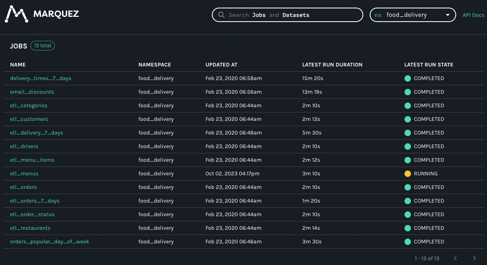

# Metadata Source

!!! example "Info"

    Generating data based on an external metadata source is a paid feature.

Creating a data generator for Postgres tables and CSV file based on metadata stored in Marquez (
follows [OpenLineage API](https://openlineage.io/)).

## Requirements

- 10 minutes
- Git
- Gradle
- Docker

## Get Started

First, we will clone the data-caterer-example repo which will already have the base project setup required.

```shell
git clone git@github.com:pflooky/data-caterer-example.git
```

### Marquez Setup

Can follow the README found [**here**](https://github.com/MarquezProject/marquez) to help with setting up Marquez in
your local environment. This comes with an instance of Postgres which we will also be using as a data store for
generated data.

The command that was run for this example to help with setup of dummy data was `./docker/up.sh -a 5001 -m 5002 --seed`.

Check that the following [url](http://localhost:3000) shows some data like below once you click on `food_delivery`
from the `ns` drop down in the top right corner.



#### Postgres Setup

Since we will also be using the Marquez Postgres instance as a data source, we will set up a separate database to store
the generated data in via:

```shell
docker exec marquez-db psql -Upostgres -c 'CREATE DATABASE food_delivery'
```

### Plan Setup

Create a new Java or Scala class.

- Java: `src/main/java/com/github/pflooky/plan/MyAdvancedMetadataSourceJavaPlanRun.java`
- Scala: `src/main/scala/com/github/pflooky/plan/MyAdvancedMetadataSourcePlanRun.scala`

Make sure your class extends `PlanRun`.

=== "Java"

    ```java
    import com.github.pflooky.datacaterer.java.api.PlanRun;
    ...
    
    public class MyAdvancedMetadataSourceJavaPlanRun extends PlanRun {
        {
            var conf = configuration().enableGeneratePlanAndTasks(true)
                .generatedReportsFolderPath("/opt/app/data/report");
        }
    }
    ```

=== "Scala"

    ```scala
    import com.github.pflooky.datacaterer.api.PlanRun
    ...
    
    class MyAdvancedMetadataSourcePlanRun extends PlanRun {
      val conf = configuration.enableGeneratePlanAndTasks(true)
        .generatedReportsFolderPath("/opt/app/data/report")
    }
    ```

We will enable generate plan and tasks so that we can read from external sources for metadata and save the reports
under a folder we can easily access.

#### Schema

We can point the schema of a data source to our Marquez instance. For the Postgres data source, we will point to a
`namespace`, which in Marquez or OpenLineage, represents a set of datasets. For the CSV data source, we will point to
a specific `namespace` and `dataset`.

##### Single Schema

=== "Java"

    ```java
    var csvTask = csv("my_csv", "/tmp/data/csv", Map.of("saveMode", "overwrite", "header", "true"))
            .schema(metadataSource().marquez("http://localhost:5001", "food_delivery", "public.delivery_7_days"))
            .count(count().records(100));
    ```

=== "Scala"

    ```scala
    val csvTask = csv("my_csv", "/tmp/data/csv")
      .schema(metadataSource.marquez("http://localhost:5001", "food_delivery", "public.categories"))
      .count(count.records(100))
    ```

The above defines that the schema will come from Marquez, which is a type of metadata source that contains information
about schemas. Specifically, it points to the `food_delivery` namespace and `public.categories` dataset to retrieve the
schema information from.

##### Multiple Schemas

=== "Java"

    ```java
    var postgresTask = postgres("my_postgres", "jdbc:postgresql://host.docker.internal:5432/food_delivery", "postgres", "password", Map.of())
        .schema(metadataSource().marquez("http://localhost:5001", "food_delivery"))
        .count(count().records(10));
    ```

=== "Scala"

    ```scala
    val postgresTask = postgres("my_postgres", "jdbc:postgresql://localhost:5432/food_delivery", "postgres", "password")
      .schema(metadataSource.marquez("http://localhost:5001", "food_delivery"))
      .count(count.records(10))
    ```

We now have pointed this Postgres instance to produce multiple schemas that are defined under the `food_delivery`
namespace. Also note that we are using database `food_delivery` in Postgres to push our generated data to, and we have
set the number of records per sub data source (in this case, per table) to be 10.

### Run

Let's try run and see what happens.

```shell
cd ..
./run.sh
#input class MyAdvancedMetadataSourceJavaPlanRun or MyAdvancedMetadataSourcePlanRun
#after completing
docker exec marquez-db psql -Upostgres -d food_delivery -c 'SELECT * FROM public.delivery_7_days'
```

It should look something like this.

```shell
 order_id |     order_placed_on     |   order_dispatched_on   |   order_delivered_on    | customer_email  |   customer_address   | menu_id | restaurant_id | restaurant_address | m
enu_item_id | category_id | discount_id | city_id | driver_id
----------+-------------------------+-------------------------+-------------------------+-----------------+----------------------+---------+---------------+--------------------+--
------------+-------------+-------------+---------+-----------
    43312 | 2022-12-20 18:42:51.025 | 2022-10-24 16:51:19.467 | 2022-12-23 12:12:36.858 | 1HD5Z519uao     | 9pQm111aRlOQNJjh9lAf |   32756 |         35740 | X                  |
      53374 |       60607 |       28921 |   83340 |     69539
    39250 | 2022-12-14 23:35:28.755 | 2022-11-05 00:27:28.985 | 2022-10-09 23:33:55.34  | m               | 2YcYHWt              |   57670 |         81243 | XKJrChD01dYCbY     |
      73260 |       75010 |       23278 |   22306 |       583
     9529 | 2023-03-05 18:39:42.775 | 2023-05-26 11:04:10.575 | 2023-08-17 09:19:02.468 | 1WaX7egq43Ud    | nYWj                 |   89439 |         35574 | kryxHDCijV         |
      47228 |       62248 |       32982 |    3130 |     54184
    42316 | 2023-03-27 08:14:00.242 | 2023-08-05 16:31:08.861 | 2023-04-19 16:34:29.116 |  aDeuBZKNVeeBP0 | 7d30pOq9NW1708Ic9i   |   65897 |         19110 | CQ                 |
      42543 |       84808 |       90898 |   66637 |     34130
    86933 | 2022-12-02 20:02:48.408 | 2023-02-15 13:01:34.69  | 2022-10-04 13:01:11.823 | C1N             | 2KhPD7A2brO          |   21623 |         94672 | Iay3Xqbrrc         |
      13435 |       32628 |       39540 |   34245 |     30558
(5 rows)
```

You can also try query some other tables. Let's also check what is in the CSV file.

```shell
$ head docker/sample/csv/part-00000-*
order_id,order_placed_on,order_dispatched_on,order_delivered_on,customer_email,customer_address,menu_id,restaurant_id,restaurant_address,menu_item_id,category_id,discount_id,city_id,driver_id
56473,2022-12-21T05:22:53.888Z,2023-08-24T22:05:12.857Z,2023-05-02T04:03:26.572Z,wtcijFoAxTzS4a,CHMKz78lxkXzj6jlV7x,87430,43666,kJkwZr,73563,89456,13805,29140,78574
48786,2023-06-05T17:57:38.667Z,2023-09-04T00:32:54.046Z,2023-01-13T11:24:29.054Z,w7Y0JUw,D5,5085,92659,Jeu6bBQ8O,13285,61853,7666,16112,67186
74240,2023-06-22T23:25:50.735Z,2023-09-14T08:50:38.726Z,2022-11-01T13:27:22.477Z,Sb42FlQNgswhZJ38Af6,gOkhnPSn,40127,39554,DSglsvoh,37710,39245,20278,16301,55736
80202,2022-12-18T12:32:14.304Z,2022-11-18T05:13:17.201Z,2023-09-18T16:58:01.327Z,t2,ioGiA2r8InRn,34493,10128,JZ7lM0zpR7sQNgZAb0,53393,85223,77023,6562,30888
```

Looks like we have some data now. But we can do better and add some enhancements to it.
  
What if we wanted the same records in Postgres `public.categories` to also show up in the CSV file? That's where we
can use a foreign key definition.

### Foreign Key


=== "Java"

    ```java
    var myPlan = plan().addForeignKeyRelationship(
            postgresTask, List.of("key", "tmp_year", "tmp_name", "value"),
            List.of(Map.entry(csvTask, List.of("account_number", "year", "name", "payload")))
    );
  
    var conf = ...

    execute(myPlan, conf, postgresTask, csvTask);
    ```

=== "Scala"

    ```scala
    val myPlan = plan.addForeignKeyRelationship(
        kafkaTask, List("key", "tmp_year", "tmp_name", "value"),
        List(csvTask -> List("account_number", "year", "name", "payload"))
    )
  
    val conf = ...

    execute(myPlan, conf, postgresTask, csvTask)
    ```

### Additional Topics

#### Order of execution

You may notice that the events are generated first, then the CSV file. This is because as part of the `execute`
function, we passed in the `kafkaTask` first, before the `csvTask`. You can change the order of execution by
passing in `csvTask` before `kafkaTask` into the `execute` function.
